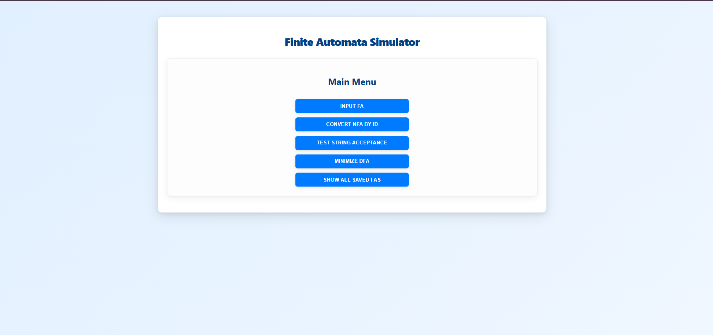
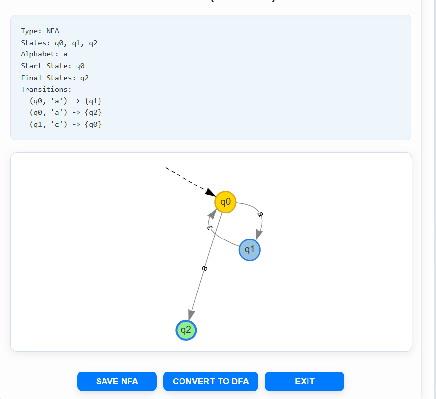
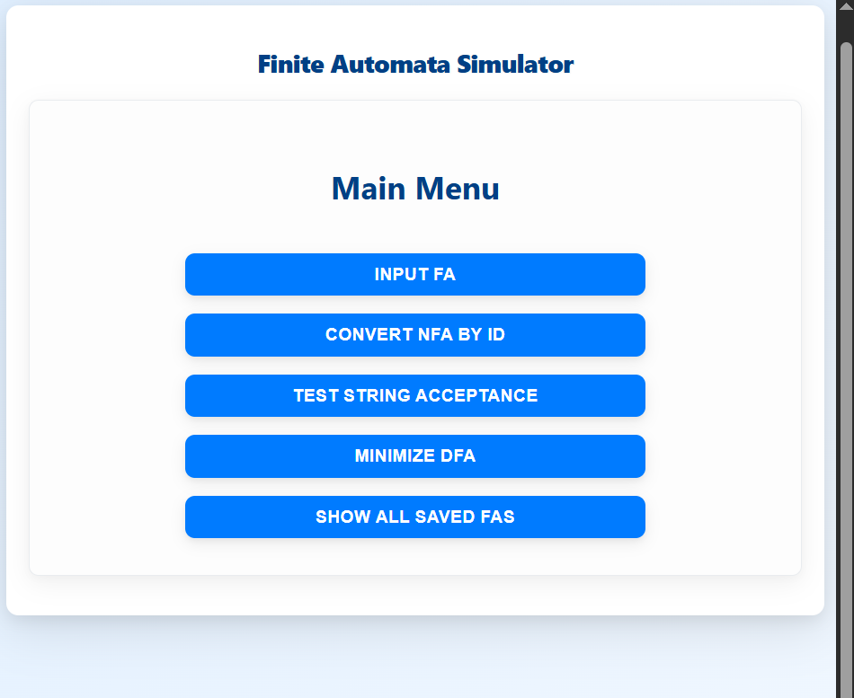
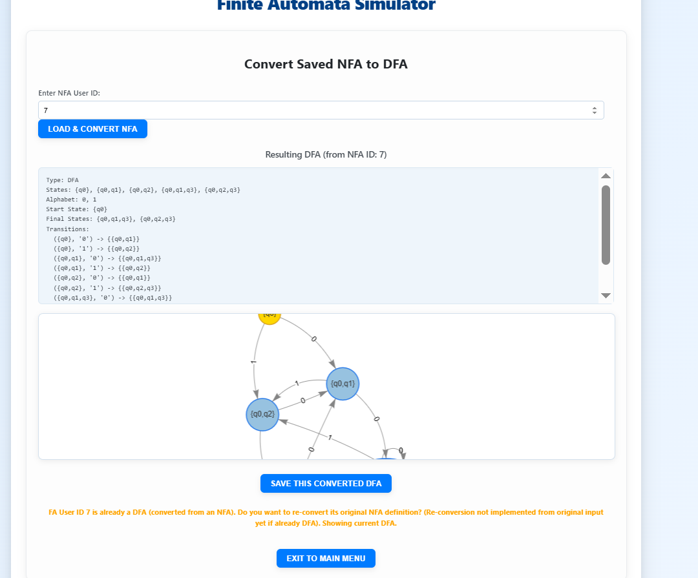
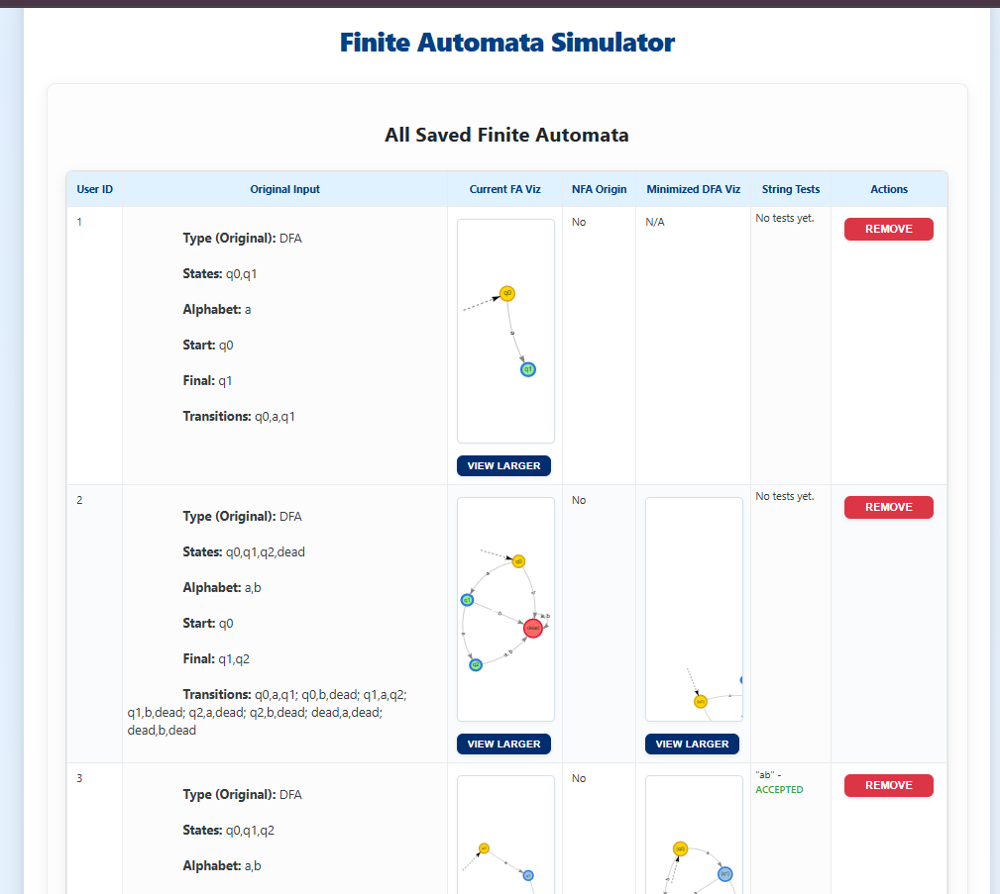

## Overview

The Finite Automata Simulator is a web-based application that allows users to create, visualize, and manipulate deterministic finite automata (DFA) and non-deterministic finite automata (NFA). This tool provides an intuitive interface for:

. Creating and saving finite automata

. Converting NFAs to equivalent DFAs

. Testing string acceptance

. Minimizing DFAs

. Visualizing automata structures

`Our main Menu`


**Features**

Core Functionality

. FA Creation: Input DFAs or NFAs through a simple form interface

. Visualization: Interactive graphical representation of automata

. NFA to DFA Conversion: Implemented using subset construction algorithm

. DFA Minimization: Uses partitioning algorithm to create minimal DFAs

. String Testing: Check if strings are accepted by saved automata

. Data Persistence: Automata are saved in browser local storage

**Advanced Features**

. Operations: View all saved automata in a comprehensive table

. Data Export: Download all automata data as JSON

. Responsive Design: Works on both desktop and mobile devices

**Getting Started**

`Prerequisites`

. Modern web browser (Chrome, Firefox, Edge, Safari)

. Internet connection (for loading vis.js library)

**Installation**

No installation required! Simply open the `index.html` file in your browser.

## Usage Guide

1.  Creating a Finite Automaton

    . Click "Input FA" from the main menu

    . Fill in the form:

        -> States: Comma-separated list (e.g., q0,q1,q2)

        -> Alphabet: Comma-separated symbols (e.g., a,b)

        -> Start State: Single state name

        -> Final States: Comma-separated list

        -> Transitions: Semicolon-separated list in format `from,symbol,to` (use {q1,q2} for NFA transitions, epsilon for ε-transitions)

    . Click "Add FA"

    . The system will automatically detect if your FA is deterministic or non-deterministic

    . You'll be taken to the appropriate screen (NFA or DFA) where you can save your automaton

**Transition Examples:**

DFA: `q0,a,q1; q1,b,q2`

NFA: `q0,a,q1; q0,a,q2;  q1,epsilon,q0`



1. Converting NFA to DFA

Method 1: From Newly Created NFA

- After creating an NFA, you'll be on the NFA screen

- Click "Convert to DFA"

- Review the resulting DFA

- Click "Save DFA" to store the converted automaton

Method 2: From Saved NFA

- From main menu, select "Convert NFA by ID"

- Enter the User ID of a saved NFA

- Click "Load & Convert NFA"

- Review and save the resulting DFA
  `implement`



Press the button number 2, then convert it by user_id



3. Testing String Acceptance

- From main menu, select "Test String Acceptance"

- Enter the User ID of a saved FA

- Click "Load FA"

- Enter a string to test in the input field

- Click "Test String"

- The result will show whether the string is accepted or rejected

- After 3 rejections, you'll get additional options

4. Minimizing a DFA

- From main menu, select "Minimize DFA"

- Enter the User ID of a saved DFA

- Click "Minimize DFA"

- View the minimized DFA (changes are automatically saved)

5. Managing Saved Automata

- From main menu, select "Show All Saved FAs"

- View all automata in a comprehensive table showing:

  -> Original input

  -> Current visualization

  -> NFA origin status

  -> Minimized version (if applicable)

  -> Test history

  

- Options available:

  -> View larger visualization

  -> Remove automata

  -> Download all data as JSON

## Troubleshooting

**Common Issues**

1. Visualization not appearing:

   . Ensure you have internet connection (vis.js is loaded from CDN)

   . Check browser console for errors

   . Refresh the page

2. FA not saving:

   . Ensure you click "Save NFA" or "Save DFA" after creation

   . Check browser storage settings (should allow local storage)

3. Conversion errors:

   . Ensure you're converting an NFA (system will warn if you try to convert a DFA)

   . Check transition formatting (especially for NFAs with multiple target states)

## Browser Compatibility

Tested and works on:

. Chrome (latest)

. Firefox (latest)

. Edge (latest)

. Safari (latest)

`License`
This project is open-source and available for educational use.

`Our team`

```name
1. Lo bunleang
2. Heng oulong
3. Panha
4. Meong
5. Pheakdey
```
